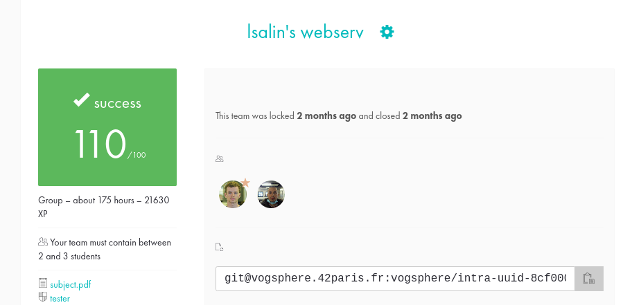

# Webserv

🇫🇷

Le projet Webserv consiste à écrire un serveur HTTP en C++98, qui sera capable de communiquer avec un navigateur web et d'effectuer plusieurs tâches courantes d'un serveur web, comme l'envoi de pages web aux clients, la prise en charge de requêtes `GET`, `POST` et `DELETE`, la possibilité d'écouter sur plusieurs ports, la gestion des fichiers de configuration, etc.

Ce projet est très formateur car il permet de comprendre en profondeur comment fonctionne un serveur web et comment les données sont échangées entre un client et un serveur.

De nombreuses notions importantes de programmation seront etudiees a travers ce projet comme les __sockets__, la __programmation multiplexee__ via l'utilisation de `select()`, ou encore l'implementation d'un __CGI__.

🇺🇸

